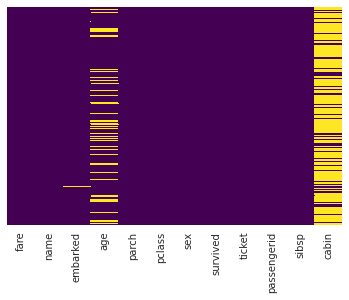
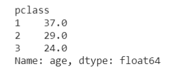
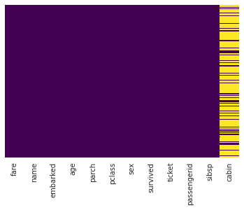
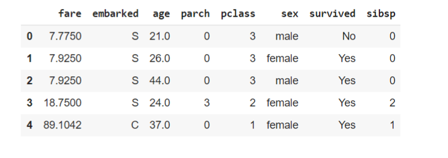
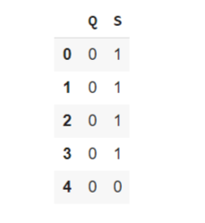
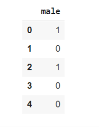
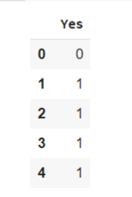
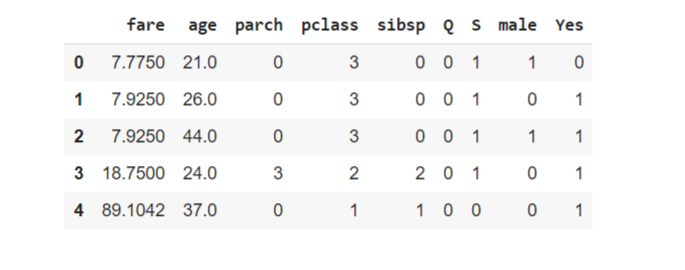

# IoTFun project
Dreamteam:
| Name | Student ID |
| --- | ----------- |
| Thataphon Srisuthep | 6030155221 |
| Natthakrit Toemphinijtham | 6030188021 |
| Thanwalai Konghun | 6030282221 |

## BEGIN CODE
```
import requests
import json
import pprint
import pandas as pd
import numpy as np
import matplotlib.pyplot as plt
import seaborn as sns
```

### Request Data
Receive the responses from the API in json file, and filter the data in a proper and useful dataframe.
```
response = requests.get('https://public.opendatasoft.com/api/records/1.0/search/?dataset=titanic-passengers&q=&rows=891&facet=survived&facet=pclass&facet=sex&facet=age&facet=embarked')
rawData = response.json()
selectData = []
data = rawData['records']
for i in range(len(data)):
  selectData.append(data[i]['fields'])
df = pd.DataFrame(selectData)

df.head()
```


### Pre-processing
#### Explore data
```
sns.heatmap(df.isnull(), yticklabels=False, cbar=False, cmap='viridis')
```


#### Fill missing data
fill the missing age data by considering p-class
```
df.groupby('pclass')['age'].median()
```

```
def impute_age(cols):
    age = cols[0]
    pclass = cols[1]
    
    if pd.isnull(age):
        if pclass == 1:
            return 37
        elif pclass == 2:
            return 29
        else:
            return 24
    else:
        return age

df['age'] = df[['age','pclass']].apply(impute_age,axis=1)
```

input the value of the one missing embarked as S.
```
df['embarked'].mode()
```

```
def impute_embarked(embarked):   
    if pd.isnull(embarked):
        return 'S'
    else:
        return embarked

df['embarked'] = df['embarked'].apply(impute_embarked)
```
Exploring the data again after filling the missing values of 'age' and 'embarked'
```
sns.heatmap(df.isnull(), yticklabels=False, cbar=False, cmap='viridis')
```


#### Drop unsignificant column
Eliminating the unsignificant columns for machine learning i.e. 'cabin', 'name', 'ticket', and 'passengerid'
```
df.drop(['cabin','name','ticket','passengerid'],axis=1,inplace=True)

df.head()
```


#### Convert categorical features
convert the string values of 'embarked', 'sex', and 'survived' into appicable form for computing machine learning.
```
embarked = pd.get_dummies(df['embarked'],drop_first=True)
sex = pd.get_dummies(df['sex'],drop_first=True)
survived = pd.get_dummies(df['survived'],drop_first=True)

embarked.head()
```
The 'embarked' column, it is splitted into two columns namely 'Q' ans 'S'. The 'sex' column is converted into 'male' column with 1 represents male and 0 represents female. The 'survived' column is transformed into 'Yes' column with 1 represents survived and 0 represents unsurvived.

```
sex.head()
```

```
servived.head()
```

```
df.drop(['embarked','sex','survived'],axis=1,inplace=True)
df = pd.concat([df,embarked,sex,survived],axis=1)

df.head()
```


### Building logistic regression model
#### train&test splitting
```
from sklearn.model_selection import train_test_split
```
Declare the training data and the testing data with 'Yes' column (Survival) as the ouput and the rest columns are the input. Given the ratio of training data to testing data is 0.3
```
X = df.drop('Yes',axis=1)
y = df['Yes']
X_train, X_test, y_train, y_test = train_test_split(X, y, stratify=y, test_size=0.30, random_state=1010)
```
#### training & prediction
```
from sklearn.linear_model import LogisticRegression
```
Creating a model fitting the training data
```
model = LogisticRegression()
model.fit(X_train,y_train)
```

Receive the predictions from the testing input data by the model.
```
predictions = model.predict(X_test)
```
### Evaluation
Compare the predictions of the model with the testing output data.
```
from sklearn.metrics import classification_report
```
```
print(classification_report(y_test,predictions))
```


